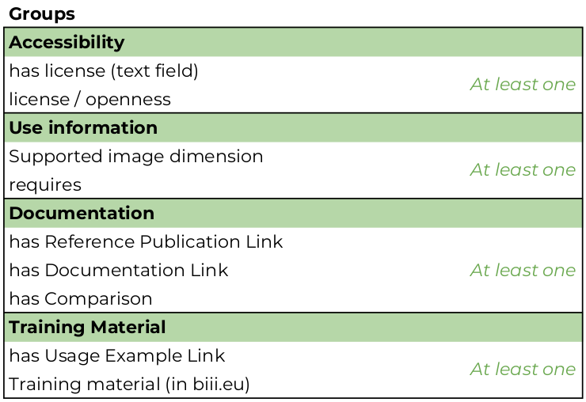

Entry information standard
===================================
BIII.eu software entry information standard 
----------------------------------
The standard described here (still under discussion) provides guidelines to support [BIII.eu webtool](http://www.biii.eu/) curators to monitor the webtool content and tagging. This standard was adapted from the [Tool information standard](https://github.com/bio-tools/biotoolsSchemaDocs/blob/master/information_standard.rst#biotools-information-standard) documentation from [ELIXIR bio.tools](https://github.com/bio-tools/). Thanks to [Jon Ison](https://github.com/joncison) for referencing this documentation. 

This standard comprises a list of entry attributes to be specified for a software entry to be classified in a 5 tier rating of entry completeness and quality in BIII.eu.

BIII.eu includes two ontologies on its framework: [Bise core ontology](https://github.com/NeuBIAS/bise-core-ontology) and [EDAM-Bioimaging](https://github.com/edamontology/edam-bioimaging>). 

In addition we provide curation guidelines describing how each attribute should be specified to ensure the quality of BIII.eu entries. These guidelines are not limited to the syntatic and semantic constraints defined by EDAM-bioimaging ontology and BISE-core-ontology

The standard provides a basis for monitoring of content and labelling of BIII.eu entries initially by: 

* **Entry completeness** (3 tiers being "SPARSE", "DETAILED", and "COMPREHENSIVE")

The standard is applied to BIII.eu as follows (condensed information available from the tables): 

* **"SPARSE"**: Minimum information requirement for new entries. A SPARSE entry may be invisible in the webtool (and made it clear to the curator adding the entry in the UI) by default and will only show after aditional information is added (similar to what occurs in bio.tools). A sparse entry has a _Name_, _Description_, _Unique ID_ (automatically created) and _type_ (collection, component, worflow, don't know). This category may not conform to biii.eu curation guidelines and for curation purposes, such entries must be shown in the list of 'to be curated' of confirmed taggers somehow as 'high priority.

* **"DETAILED"**: This is the mid-completeness category. An entry with 'Basic details' shall have _implementation type_ (Library, plugin, standalone, and web application), _Entry point_ (URL of the repository or 'official' website), an _illustrative image_ (preferably a screenshot of the UI, or the input/output results, but logo whenever it fits), _author_ ( in the form of `LastName, FirstName (ORCID ID)`) and at least one _function_ (EDAM-Bioimaging Operation Class, for example, model-based segmentation or object feature extraction). In this category there must be at least one attribute from the _Accesibility_ and _Use information_ groups. In addition, the _programming language_ of the tool is defined as well as its _execution platform_ (Operating System). This category may not conform to biii.eu curation guidelines and for curation purposes, such entries must be shown in the list of 'to be curated' of confirmed taggers without any warning. 

* **"COMPREHENSIVE"**: Such entries would provide relevant information to users of all backgrounds and are useful resources and must include at least one attribute from the _Documentation_ group, at least one _Topic_ (EDAM-Bioimaging Topic Class, for example, fluorescence microscopy, Single molecule localization miroscopy and machine learning), one _biological term_ (which is not a mandatory attribute, but highly recommended) and the DOI of its implementation. Since DOIs of implementations are still not common, this is also an optional attribute (See also: [Making your code citable](https://guides.github.com/activities/citable-code/) and [DOI Registrations for software - DataCite Blog](https://blog.datacite.org/doi-registrations-software/)). The additional entry attributes that make an entry comprehensive are _Additional keywords_ (not covered by biological terms or EDAM-Bioimaging) and at _at least_ one _training material_ attribute and may have more than just one _biological term_, _EDAM-Bioimaging Operations_ and _Topics_.  This category conforms to biii.eu curation guidelines and for curation purposes, such entries must be shown in the list of 'to be curated' of confirmed taggers without any warning.
